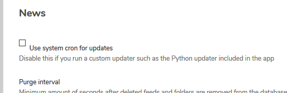

<p align="center"><a href="https://github.com/crazy-max/docker-nextcloud" target="_blank"></a></p>

<p align="center">
  <a href="https://hub.docker.com/r/crazymax/nextcloud/tags?page=1&ordering=last_updated"></a>
  <a href="https://github.com/crazy-max/docker-nextcloud/actions?workflow=build"></a>
  <a href="https://hub.docker.com/r/crazymax/nextcloud/"></a>
  <a href="https://hub.docker.com/r/crazymax/nextcloud/"></a>
  <br /><a href="https://github.com/sponsors/crazy-max"></a>
  <a href="https://www.paypal.me/crazyws"></a>
</p>

## About

[Nextcloud](https://nextcloud.com) Docker image based on Alpine Linux and Nginx with advanced features.<br />
If you are interested, [check out](https://hub.docker.com/r/crazymax/) my other Docker images!

💡 Want to be notified of new releases? Check out 🔔 [Diun (Docker Image Update Notifier)](https://github.com/crazy-max/diun) project!

___

* [Features](#features)
* [Image](#image)
* [Environment variables](#environment-variables)
  * [General](#general)
  * [Nextcloud](#nextcloud)
  * [Cron](#cron)
  * [Previews generator](#previews-generator)
  * [News Updater](#news-updater)
* [Volumes](#volumes)
* [Ports](#ports)
* [Usage](#usage)
  * [Docker Compose](#docker-compose)
  * [Command line](#command-line)
* [Upgrade](#upgrade)
* [Notes](#notes)
  * [First installation](#first-installation)
  * [OCC command](#occ-command)
  * [Cron sidecar](#cron-sidecar)
  * [Previews generator sidecar](#previews-generator-sidecar)
  * [Nextcloud News Updater](#nextcloud-news-updater)
  * [Email server](#email-server)
  * [Redis cache](#redis-cache)
  * [Running in a subdir](#running-in-a-subdir)
* [How can I help?](#how-can-i-help)
* [License](#license)

## Features

* Run as non-root user
* Multi-platform image
* Tarball authenticity checked during building process
* Data, config, user apps and themes persistence in the same folder
* [Automatic installation](https://docs.nextcloud.com/server/stable/admin_manual/configuration_server/automatic_configuration.html)
* Cron task for [Nextcloud background jobs](https://docs.nextcloud.com/server/stable/admin_manual/configuration_server/background_jobs_configuration.html#cron) as a [sidecar cron container](#cron-sidecar)
* Execute pre-generation of previews through [Preview Generator](https://github.com/rullzer/previewgenerator) plugin
* Handle [Nextcloud News Updater](https://github.com/nextcloud/news-updater) for [News plugin](https://apps.nextcloud.com/apps/news) through a [sidecar news updater container](#nextcloud-news-updater)
* OPCache enabled to store precompiled script bytecode in shared memory
* APCu installed and configured
* Memcached and Redis also enabled to enhance server performance
* Database connectors MySQL/MariaDB, PostgreSQL and SQLite3 enabled
* Exif, IMAP, LDAP, FTP, GMP, SMB enabled (required for specific apps)
* FFmpeg, iconv, Imagick installed for preview generation
* [s6-overlay](https://github.com/just-containers/s6-overlay/) as process supervisor
* [Traefik](https://github.com/containous/traefik-library-image) as reverse proxy and creation/renewal of Let's Encrypt certificates (see [this template](examples/traefik))
* [msmtpd SMTP relay](https://github.com/crazy-max/docker-msmtpd) image to send emails
* [Redis](https://github.com/docker-library/redis) for caching
* [Collabora](https://github.com/CollaboraOnline/Docker-CODE) as an online Office Suite (see [this template](examples/traefik))
* [MariaDB](https://github.com/docker-library/mariadb) as database instance

## Image

| Registry                                                                                         | Image                           |
|--------------------------------------------------------------------------------------------------|---------------------------------|
| [Docker Hub](https://hub.docker.com/r/crazymax/nextcloud/)                                            | `crazymax/nextcloud`                 |
| [GitHub Container Registry](https://github.com/users/crazy-max/packages/container/package/nextcloud)  | `ghcr.io/crazy-max/nextcloud`        |

Following platforms for this image are available:

```
$ docker run --rm mplatform/mquery crazymax/nextcloud:latest
Image: crazymax/nextcloud:latest
 * Manifest List: Yes
 * Supported platforms:
   - linux/amd64
   - linux/arm/v6
   - linux/arm/v7
   - linux/arm64
   - linux/386
   - linux/ppc64le
   - linux/s390x
```

## Environment variables

### General

* `TZ`: The timezone assigned to the container (default `UTC`)
* `PUID`: Nextcloud user id (default `1000`)
* `PGID`: Nextcloud group id (default `1000`)
* `MEMORY_LIMIT`: PHP memory limit (default `512M`)
* `UPLOAD_MAX_SIZE`: Upload max size (default `512M`)
* `CLEAR_ENV`: Clear environment in FPM workers (default `yes`)
* `OPCACHE_MEM_SIZE`: PHP OpCache memory consumption (default `128`)
* `LISTEN_IPV6`: Enable IPv6 for Nginx (default `true`)
* `APC_SHM_SIZE`: APCu memory size (default `128M`)
* `REAL_IP_FROM`: Trusted addresses that are known to send correct replacement addresses (default `0.0.0.0/32`)
* `REAL_IP_HEADER`: Request header field whose value will be used to replace the client address (default `X-Forwarded-For`)
* `LOG_IP_VAR`: Use another variable to retrieve the remote IP address for access [log_format](http://nginx.org/en/docs/http/ngx_http_log_module.html#log_format) on Nginx. (default `remote_addr`)

### Nextcloud

* `HSTS_HEADER`: [HTTP Strict Transport Security](https://docs.nextcloud.com/server/stable/admin_manual/installation/harden_server.html#enable-http-strict-transport-security) header value (default `max-age=15768000; includeSubDomains`)
* `XFRAME_OPTS_HEADER`: [X-Frame-Options](https://docs.nextcloud.com/server/stable/admin_manual/installation/harden_server.html#serve-security-related-headers-by-the-web-server) header value (default `SAMEORIGIN`)
* `RP_HEADER`: [Referrer Policy](https://docs.nextcloud.com/server/stable/admin_manual/installation/harden_server.html#serve-security-related-headers-by-the-web-server) header value (default `strict-origin`)
* `SUBDIR`: [Subdir](https://docs.nextcloud.com/server/stable/admin_manual/installation/nginx.html#nextcloud-in-a-subdir-of-nginx) to use. Read [this section](#running-in-a-subdir) for more info.
* `DB_TYPE`: Database type (mysql, pgsql or sqlite) (default `sqlite`)
* `DB_NAME`: Database name (default `nextcloud`)
* `DB_USER`: Username for database (default `nextcloud`)
* `DB_PASSWORD`: Password for database user
* `DB_HOST`: Database host (default `db`)

> 💡 `DB_PASSWORD_FILE` can be used to fill in the value from a file, especially for Docker's secrets feature.

### Cron

> :warning: Only used if you enable and run a [sidecar cron container](#cron-sidecar)

* `SIDECAR_CRON`: Set to `1` to enable sidecar cron mode (default `0`)
* `CRON_PERIOD`: Periodically execute Nextcloud [cron](https://docs.nextcloud.com/server/stable/admin_manual/configuration_server/background_jobs_configuration.html#cron) (eg. `*/5 * * * *`)

### Previews generator

> :warning: Only used if you enable and run a [sidecar previews generator container](#previews-generator-sidecar)

* `SIDECAR_PREVIEWGEN`: Set to `1` to enable sidecar previews generator mode (default `0`)
* `PREVIEWGEN_PERIOD`: Periodically execute pre-generation of previews (eg. `0 * * * *`)

### News Updater

> :warning: Only used if you enable and run a [sidecar news updater container](#nextcloud-news-updater)

* `SIDECAR_NEWSUPDATER`: Set to `1` to enable sidecar news updater mode (default `0`)
* `NC_NEWSUPDATER_THREADS`: How many feeds should be fetched in parallel (default `10`)
* `NC_NEWSUPDATER_TIMEOUT`: Maximum number of seconds for updating a feed (default `300`)
* `NC_NEWSUPDATER_INTERVAL`: Update interval between fetching the next round of updates in seconds (default `900`)
* `NC_NEWSUPDATER_LOGLEVEL`: Log granularity, `info` will log all urls and received data, `error` will only log errors (default `error`)

## Volumes

* `/data`: Contains config, data folders, installed user apps (not core ones), session, themes, tmp folders

> :warning: Note that the volume should be owned by the user/group with the specified `PUID` and `PGID`. If you don't give the volume correct permissions, the container may not start.

## Ports

* `8000`: HTTP port

## Usage

### Docker Compose

Docker compose is the recommended way to run this image. Copy the content of folder [examples/compose](examples/compose)
in `/var/nextcloud/` on your host for example. Edit the compose and env files with your preferences and run the
following commands:

```bash
docker-compose up -d
docker-compose logs -f
```

### Command line

You can also use the following minimal command:

```bash
docker run -d -p 8000:8000 --name nextcloud \
  -v "$(pwd)/data:/data" \
  crazymax/nextcloud:latest
```

## Upgrade

To upgrade to the latest version of Nextcloud, pull the newer image and launch the container. Nextcloud will upgrade
automatically:

```bash
docker-compose pull
docker-compose up -d
```

## Notes

### First installation

If you run the container for the first time, the installation will be automatic using the `DB_*` environment variables.<br />
Then open your browser to configure your admin account.

### OCC command

If you want to use the [occ command](https://docs.nextcloud.com/server/stable/admin_manual/configuration_server/occ_command.html)
to perform common server operations like manage users, encryption, passwords, LDAP setting, and more, type:

```bash
docker-compose exec nextcloud occ
```

### Cron sidecar

If you want to enable the cronjob, you have to run a "sidecar" container (see cron service in
[docker-compose.yml](examples/compose/docker-compose.yml) example) or run a simple container like this:

```bash
docker run -d --name nextcloud_cron \
  --env-file $(pwd)/nextcloud.env \
  -e "SIDECAR_CRON=1" \
  -e "CRON_PERIOD=*/5 * * * *" \
  -v "$(pwd)/data:/data" \
  crazymax/nextcloud:latest
```

And do not forget to choose **Cron** as background jobs:


### Previews generator sidecar

To execute pre-generation of previews through the [Preview Generator](https://github.com/rullzer/previewgenerator)
plugin, you have to run a "sidecar" container (see cron service in [docker-compose.yml](examples/compose/docker-compose.yml)
example) or run a simple container like this:

```bash
docker run -d --name nextcloud_previewgen \
  --env-file $(pwd)/nextcloud.env \
  -e "SIDECAR_PREVIEWGEN=1" \
  -e "PREVIEWGEN_PERIOD=0 * * * *" \
  -v "$(pwd)/data:/data" \
  crazymax/nextcloud:latest
```

### Nextcloud News Updater

If you want to enable the [Nextcloud News Updater](https://github.com/nextcloud/news-updater), you have to run a
"sidecar" container (see news_updater service in [docker-compose.yml](examples/compose/docker-compose.yml) example)
or run a simple container like this:

```bash
docker run -d --name nextcloud_news_updater \
  --env-file $(pwd)/nextcloud.env \
  -e "SIDECAR_NEWSUPDATER=1" \
  -e "NC_NEWSUPDATER_THREADS=10" \
  -e "NC_NEWSUPDATER_TIMEOUT=300" \
  -e "NC_NEWSUPDATER_INTERVAL=900" \
  -e "NC_NEWSUPDATER_LOGLEVEL=error" \
  -v "$(pwd)/data:/data" \
  crazymax/nextcloud:latest
```

And do not forget to disable **Use system cron for updates** in news settings:



### Email server

You can use our SMTP relay `msmtpd` service published on port `2500` and declared in our
[`docker-compose.yml`](examples/compose/docker-compose.yml):


### Redis cache

Redis is recommended, alongside APCu to make Nextcloud faster.
If you want to enable Redis, deploy a redis container (see [docker-compose file](examples/compose/docker-compose.yml))
and add this to your `config.php`:

```
    'memcache.local' => '\OC\Memcache\APCu',
    'memcache.distributed' => '\OC\Memcache\Redis',
    'memcache.locking' => '\OC\Memcache\Redis',
    'redis' => array(
        'host' => 'redis',
        'port' => 6379,
    ),
```

### Running in a subdir

If you want to access your Nextcloud installation in a subdir (like `/nextcloud`), you have to set the `SUBDIR`
environment variable and also add `PathPrefixStrip:/nextcloud` to your frontend rule if you use Traefik.
Do not forget to remove `includeSubDomains` option in `HSTS_HEADER` if used.

## How can I help?

All kinds of contributions are welcome :raised_hands:! The most basic way to show your support is to star :star2:
the project, or to raise issues :speech_balloon: You can also support this project by
[**becoming a sponsor on GitHub**](https://github.com/sponsors/crazy-max) :clap: or by making a
[Paypal donation](https://www.paypal.me/crazyws) to ensure this journey continues indefinitely! :rocket:

Thanks again for your support, it is much appreciated! :pray:

## License

MIT. See `LICENSE` for more details.
