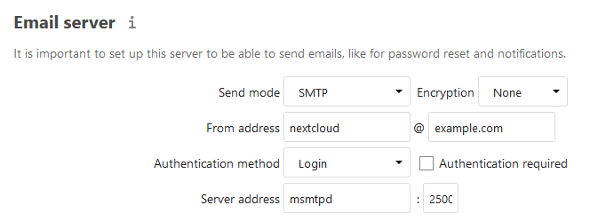

<p align="center"><a href="https://github.com/crazy-max/docker-nextcloud" target="_blank"></a></p>

<p align="center">
  <a href="https://hub.docker.com/r/crazymax/nextcloud/"></a>
  <a href="https://travis-ci.com/crazy-max/docker-nextcloud"></a>
  <a href="https://hub.docker.com/r/crazymax/nextcloud/"></a>
  <a href="https://hub.docker.com/r/crazymax/nextcloud/"></a>
  <a href="https://quay.io/repository/crazymax/nextcloud"></a>
  <a href="https://www.codacy.com/app/crazy-max/docker-nextcloud"></a>
  <a href="https://www.paypal.com/cgi-bin/webscr?cmd=_s-xclick&hosted_button_id=ADCA2SNLJ9FW4"></a>
</p>

## About

🐳 [Nextcloud](https://nextcloud.com) Docker image based on Alpine Linux and Nginx with advanced features.<br />
If you are interested, [check out](https://hub.docker.com/r/crazymax/) my other 🐳 Docker images!

## Features

### Included

* Alpine Linux 3.10, Nginx, PHP 7.3
* Tarball authenticity checked during building process
* Data, config, user apps and themes persistence in the same folder
* [Automatic installation](https://docs.nextcloud.com/server/stable/admin_manual/configuration_server/automatic_configuration.html)
* Cron task for [Nextcloud background jobs](https://docs.nextcloud.com/server/stable/admin_manual/configuration_server/background_jobs_configuration.html#cron) as a [sidecar cron container](#cronjob)
* Handle [Nextcloud News Updater](https://github.com/nextcloud/news-updater) for [News plugin](https://apps.nextcloud.com/apps/news) through a [sidecar news updater container](#nextcloud-news-updater)
* OPCache enabled to store precompiled script bytecode in shared memory
* APCu installed and configured
* Memcached and Redis also enabled to enhance server performance
* Database connectors MySQL/MariaDB, PostgreSQL and SQLite3 enabled
* Exif, IMAP, LDAP, FTP, GMP, SMB enabled (required for specific apps)
* FFmpeg, iconv, Imagick installed for preview generation

### From docker-compose

* [Traefik](https://github.com/containous/traefik-library-image) as reverse proxy and creation/renewal of Let's Encrypt certificates
* [Redis](https://github.com/docker-library/redis) for caching
* [Collabora](https://github.com/CollaboraOnline/Docker-CODE) as an online Office Suite
* [MariaDB](https://github.com/docker-library/mariadb) as database instance
* Nextcloud cron job as a ["sidecar" container](#cron)

## Docker

### Environment variables

#### General

* `TZ` : The timezone assigned to the container (default `UTC`)
* `MEMORY_LIMIT` : PHP memory limit (default `512M`)
* `UPLOAD_MAX_SIZE` : Upload max size (default `512M`)
* `OPCACHE_MEM_SIZE` : PHP OpCache memory consumption (default `128`)
* `APC_SHM_SIZE` : APCu memory size (default `128M`)
* `REAL_IP_FROM` : Trusted addresses that are known to send correct replacement addresses (default `0.0.0.0/32`)
* `REAL_IP_HEADER` : Request header field whose value will be used to replace the client address (default `X-Forwarded-For`)
* `LOG_IP_VAR` : Use another variable to retrieve the remote IP address for access [log_format](http://nginx.org/en/docs/http/ngx_http_log_module.html#log_format) on Nginx. (default `remote_addr`)

#### Nextcloud

* `HSTS_HEADER` : [HTTP Strict Transport Security](https://docs.nextcloud.com/server/stable/admin_manual/configuration_server/harden_server.html?highlight=harden#enable-http-strict-transport-security) header value (default `max-age=15768000; includeSubDomains`)
* `RP_HEADER` : [Referrer Policy](https://www.w3.org/TR/referrer-policy/) header value (default `strict-origin`)
* `SUBDIR` : [Subdir](https://docs.nextcloud.com/server/stable/admin_manual/installation/nginx.html#nextcloud-in-a-subdir-of-nginx) to use. Read [this section](#running-in-a-subdir) for more info.
* `DB_TYPE` : Database type (mysql, pgsql or sqlite) (default `sqlite`)
* `DB_NAME` : Database name (default `nextcloud`)
* `DB_USER` : Username for database (default `nextcloud`)
* `DB_PASSWORD` : Password for database user (default `asupersecretpassword`)
* `DB_HOST` : Database host (default `db`)

#### Cron

> :warning: Only used if you enabled and run a [sidecar cron container](#cronjob)

* `SIDECAR_CRON` : Set to `1` to enable sidecar cron mode (default `0`)
* `CRON_PERIOD` : Periodically execute Nextcloud [cron](https://docs.nextcloud.com/server/stable/admin_manual/configuration_server/background_jobs_configuration.html#cron) (eg. `*/15 * * * *`)

#### News Updater

> :warning: Only used if you enabled and run a [sidecar news updater container](#nextcloud-news-updater)

* `SIDECAR_NEWSUPDATER` : Set to `1` to enable sidecar news updater mode (default `0`)
* `NC_NEWSUPDATER_THREADS` : How many feeds should be fetched in parallel (default `10`)
* `NC_NEWSUPDATER_TIMEOUT` : Maximum number of seconds for updating a feed (default `300`)
* `NC_NEWSUPDATER_INTERVAL` : Update interval between fetching the next round of updates in seconds (default `900`)
* `NC_NEWSUPDATER_LOGLEVEL` : Log granularity, `info` will log all urls and received data, `error` will only log errors (default `error`)

### Volumes

* `/data` : Contains config, data folders, installed user apps (not core ones), session, themes, tmp folders

### Ports

* `8000` : HTTP port

## Use this image

### Docker Compose

Docker compose is the recommended way to run this image. Copy the content of folder [examples/compose](examples/compose) in `/var/nextcloud/` on your host for example. Edit the compose and env files with your preferences and run the following commands :

```bash
touch acme.json
chmod 600 acme.json
docker-compose up -d
docker-compose logs -f
```

### Command line

You can also use the following minimal command :

```bash
docker run -d -p 8000:8000 --name nextcloud \
  -v $(pwd)/data:/data \
  crazymax/nextcloud:latest
```

## Notes

### First installation

If you run the container for the first time, the installation will be automatic using the `DB_*` environment variables.<br />
Then open your browser to configure your admin account.

### OCC command

If you want to use the [occ command](https://docs.nextcloud.com/server/stable/admin_manual/configuration_server/occ_command.html) to perform common server operations like manage users, encryption, passwords, LDAP setting, and more, type :

```bash
docker-compose exec nextcloud occ
```

### Cronjob

If you want to enable the cronjob, you have to run a "sidecar" container (see cron service in [docker-compose.yml](examples/compose/docker-compose.yml) example) or run a simple container like this :

```bash
docker run -d --name nextcloud_cron \
  --env-file $(pwd)/nextcloud.env \
  -e SIDECAR_CRON=1 \
  -e CRON_PERIOD=*/15 * * * * \
  -v $(pwd)/data:/data \
  crazymax/nextcloud:latest
```

And do not forget to choose **Cron** as background jobs :


### Nextcloud News Updater

If you want to enable the [Nextcloud News Updater](https://github.com/nextcloud/news-updater), you have to run a "sidecar" container (see news_updater service in [docker-compose.yml](examples/compose/docker-compose.yml) example) or run a simple container like this :

```bash
docker run -d --name nextcloud_news_updater \
  --env-file $(pwd)/nextcloud.env \
  -e SIDECAR_NEWSUPDATER=1 \
  -e NC_NEWSUPDATER_THREADS=10 \
  -e NC_NEWSUPDATER_TIMEOUT=300 \
  -e NC_NEWSUPDATER_INTERVAL=900 \
  -e NC_NEWSUPDATER_LOGLEVEL=error \
  -v $(pwd)/data:/data \
  crazymax/nextcloud:latest
```

And do not forget to disable **Use system cron for updates** in news settings :


### Email

Configure your **Email server** settings with your preferences :



### Redis cache

Redis is recommended, alongside APCu to make Nextcloud more faster.
If you want to enable Redis, deploy a redis container (see [docker-compose file](examples/compose/docker-compose.yml)) and add this to your `config.php` :

```
    'memcache.local' => '\OC\Memcache\APCu',
    'memcache.distributed' => '\OC\Memcache\Redis',
    'memcache.locking' => '\OC\Memcache\Redis',
    'redis' => array(
        'host' => 'redis',
        'port' => 6379,
    ),
```

### Running in a subdir

If you want to access your Nextcloud installation in a subdir (like `/nextcloud`), you have to set the `SUBDIR` environment variable and also add `PathPrefixStrip:/nextcloud` to your frontend rule if you use Traefik. Do not forget to remove `includeSubDomains` option in `HSTS_HEADER` if used.

## Upgrade

To upgrade to the latest version of Nextcloud, pull the newer image and launch the container. Nextcloud will upgrade automatically :

```bash
docker-compose pull
docker-compose up -d
```

## How can I help ?

All kinds of contributions are welcome :raised_hands:!<br />
The most basic way to show your support is to star :star2: the project, or to raise issues :speech_balloon:<br />
But we're not gonna lie to each other, I'd rather you buy me a beer or two :beers:!

[](https://www.paypal.com/cgi-bin/webscr?cmd=_s-xclick&hosted_button_id=ADCA2SNLJ9FW4)

## License

MIT. See `LICENSE` for more details.
